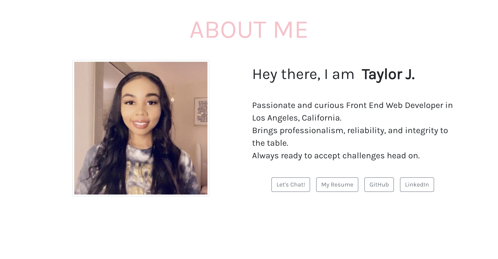
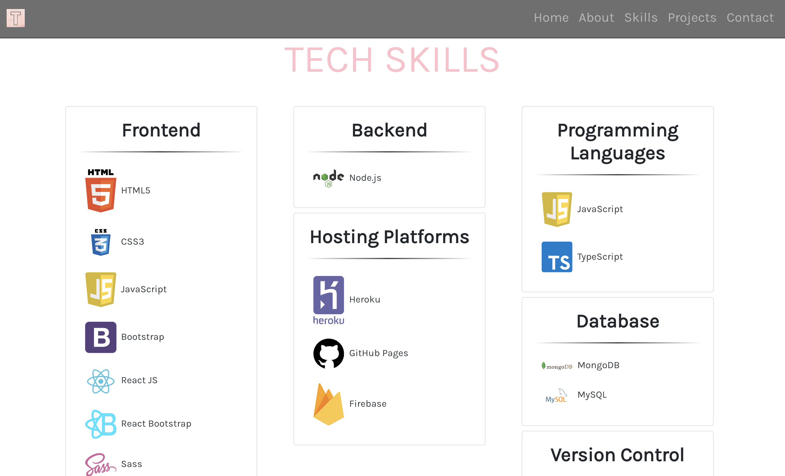

# React Portfolio 👩🏽‍💻

This is a portfolio created using React.

---

# Screenshots

---

# Link To Application 👇🏽

> [Deployed Application](https://tajohnsonn.github.io/react-portfolio/)

# Github Repo 👇🏽

> [2020 Portfolio Repo](https://github.com/tajohnsonn/react-portfolio)

# Installation

npm init to get all required modules

>

# License

MIT

>

# Questions ❓

If you have any questions about this project, please open an issue or contact Taylor J. directly at tajohnsonn@gmail.com 👩🏽‍💻

